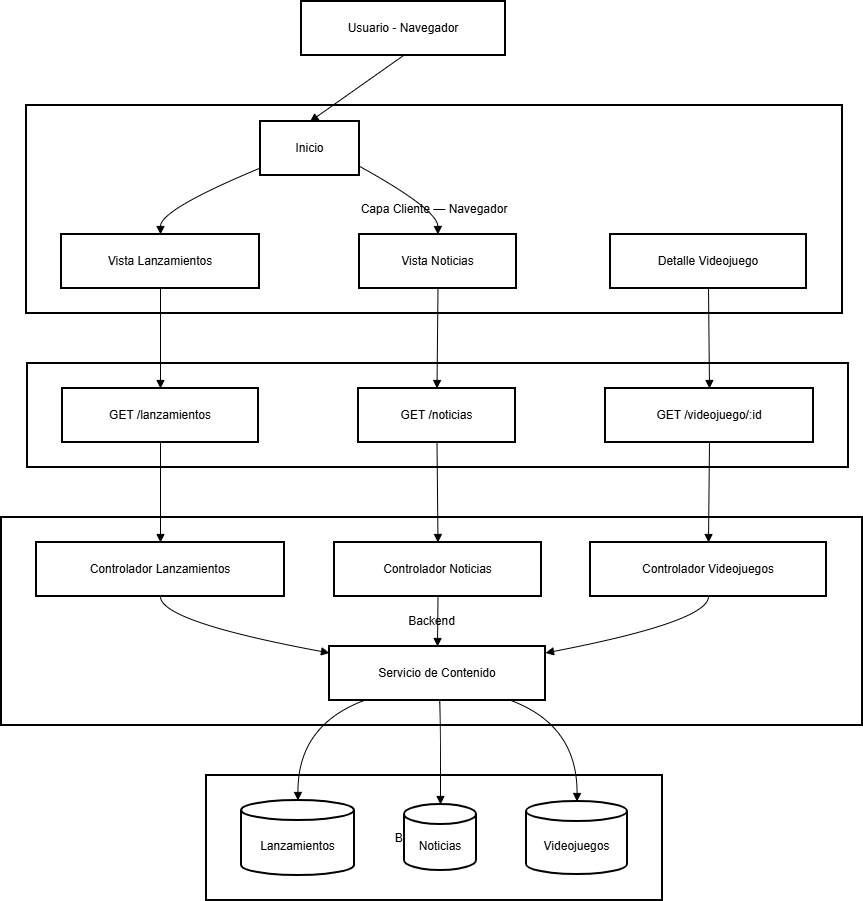

# Diagrama de proyecto.
# Nombres : Brahian Gomez Rivera . Samuel Molina Perez

#  Proyecto: Página Web de noticias de Videojuegos.

##  Descripción General.

Este proyecto consiste en una página web básica enfocada en mostrar:

-  Lanzamientos de videojuegos
-  Noticias del sector gaming
-  Información detallada de videojuegos

#  Arquitectura del Sistema.

El sistema está dividido en 4 capas principales:

1. Capa Cliente (Frontend)
2. API HTTP
3. Backend
4. Base de Datos

# 1️ Capa Cliente — Navegador.

Esta capa representa la interfaz con la que interactúa el usuario.

## Componentes:

- **Inicio**
- **Vista Lanzamientos**
- **Vista Noticias**
- **Detalle Videojuego**

## Función:

Permite al usuario:
- Consultar los próximos lanzamientos
- Leer noticias recientes
- Ver información detallada de un videojuego específico

#  API HTTP.

Esta capa gestiona las solicitudes entre el cliente y el servidor.

## Endpoints:

- `GET /lanzamientos`
- `GET /noticias`
- `GET /videojuego/:id`

## Función:

Recibe las solicitudes del navegador y las redirige al controlador correspondiente en el backend.

#  Backend.

Aquí se encuentra la lógica del negocio del sistema.

## Controladores:

- Controlador Lanzamientos
- Controlador Noticias
- Controlador Videojuegos

Todos los controladores utilizan:

- **Servicio de Contenido**

## Función del Servicio de Contenido:

Centraliza la lógica para:
- Obtener información
- Procesar datos
- Consultar la base de datos

Esto evita duplicar código y mejora la organización del proyecto.

# 4 Base de Datos.

Contiene la información almacenada del sistema.

## Colecciones / Tablas:

- Lanzamientos
- Noticias
- Videojuegos

## Función:

Guardar y proporcionar la información solicitada por el backend.

# Flujo del Sistema.

1. El usuario entra al Inicio desde el navegador.
2. Selecciona una sección (Lanzamientos o Noticias).
3. El frontend realiza una petición GET a la API.
4. La API redirige la solicitud al controlador correspondiente.
5. El controlador utiliza el Servicio de Contenido.
6. El servicio consulta la Base de Datos.
7. Los datos regresan al navegador para mostrarse al usuario.

#  Objetivo del Proyecto.

Crear una plataforma informativa sencilla sobre videojuegos que:

- Sea clara y organizada
- Tenga separación de responsabilidades
- Permita escalar fácilmente en el futuro
