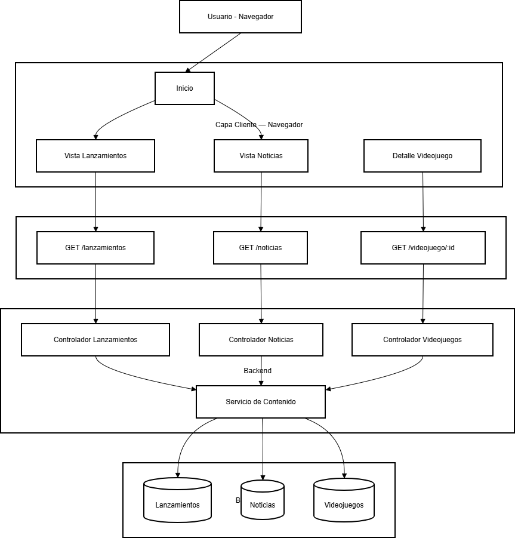

<<<<<<< HEAD
# 🎮 Gaming Pulse - Portal Pro

## Descripción
Gaming Pulse es una aplicación web full-stack diseñada para la gestión y publicación de noticias, reseñas y novedades de hardware en la industria de los videojuegos. Resuelve la necesidad de tener un portal centralizado donde un equipo de redacción pueda publicar contenido de forma rápida, y los usuarios puedan consumirlo con una interfaz moderna y responsiva.

## Integrantes
* **Brahian David Gómez Rivera** - Desarrollo Backend y Frontend.
* **Samuel molina** - Documentación y Pruebas - Diseño de UI/UX y Arquitectura.
=======
# Diagrama de proyecto.
Brahian Gomez Rivera.  .Samuel Molina Perez

#  Proyecto: Página Web de noticias de Videojuegos.

##  Descripción General.
>>>>>>> 39b963b2ebc4f5d85a300f6fcae0457c0d324f9b

## Stack Tecnológico
* **Frontend:** HTML5, CSS3, JavaScript Vanilla (Fetch API). Elegido por su ligereza y control total sobre el DOM sin dependencias.
* **Backend:** Node.js con Express. Elegido por su velocidad para crear APIs RESTful.
* **Persistencia:** Archivo `database.json` gestionado desde el backend. Elegido como solución académica para garantizar la persistencia local sin requerir un servidor de base de datos externo.

## Arquitectura
El proyecto sigue un patrón Cliente-Servidor (SPA + API). Para más detalles, consultar [docs/arquitectura.md](docs/arquitectura.md).

## Funcionalidades Principales
* Panel de administración protegido (Login).
* CRUD completo de noticias (Crear, Leer, Eliminar).
* Filtrado de publicaciones por categoría.
* Formulario de contacto para reclutamiento de redactores.
* Diseño UI/UX responsivo (Glassmorphism).

<<<<<<< HEAD
## Cómo ejecutar localmente
1. Clonar el repositorio: `git clone [URL_DEL_REPO]`
2. Instalar dependencias: `npm install express`
3. Iniciar el servidor: `node server.js`
4. Abrir en el navegador: `http://localhost:3000`
=======
#  Arquitectura del Sistema.
>>>>>>> 39b963b2ebc4f5d85a300f6fcae0457c0d324f9b

## Endpoints Principales
| Método | Endpoint | Descripción |
|---|---|---|
| GET | `/api/posts` | Lista todas las noticias |
| POST | `/api/posts` | Crea una nueva noticia |
| DELETE | `/api/posts/:id` | Elimina una noticia por ID |
| POST | `/api/login` | Valida credenciales de acceso |

<<<<<<< HEAD
## Documentación
* [Software Requirements Specification (SRS)](docs/SRS.md)
* [Arquitectura y Tecnologías](docs/arquitectura.md)
=======
1. Capa Cliente (Frontend)
2. API HTTP
3. Backend
4. Base de Datos

# 1️ Capa Cliente — Navegador.

Esta capa representa la interfaz con la que interactúa el usuario.

## Componentes:

- **Inicio**
- **Vista Lanzamientos**
- **Vista Noticias**
- **Detalle Videojuego**

## Función:

Permite al usuario:
- Consultar los próximos lanzamientos
- Leer noticias recientes
- Ver información detallada de un videojuego específico

# 2  API HTTP.

Esta capa gestiona las solicitudes entre el cliente y el servidor.

## Endpoints:

- `GET /lanzamientos`
- `GET /noticias`
- `GET /videojuego/:id`

## Función:

Recibe las solicitudes del navegador y las redirige al controlador correspondiente en el backend.

# 3  Backend.

Aquí se encuentra la lógica del negocio del sistema.

## Controladores:

- Controlador Lanzamientos
- Controlador Noticias
- Controlador Videojuegos

Todos los controladores utilizan:

- **Servicio de Contenido**

## Función del Servicio de Contenido:

Centraliza la lógica para:
- Obtener información
- Procesar datos
- Consultar la base de datos

Esto evita duplicar código y mejora la organización del proyecto.

# 4 Base de Datos.

Contiene la información almacenada del sistema.

## Colecciones / Tablas:

- Lanzamientos
- Noticias
- Videojuegos

## Función:

Guardar y proporcionar la información solicitada por el backend.

# Flujo del Sistema.

1. El usuario entra al Inicio desde el navegador.
2. Selecciona una sección (Lanzamientos o Noticias).
3. El frontend realiza una petición GET a la API.
4. La API redirige la solicitud al controlador correspondiente.
5. El controlador utiliza el Servicio de Contenido.
6. El servicio consulta la Base de Datos.
7. Los datos regresan al navegador para mostrarse al usuario.

#  Objetivo del Proyecto.

Crear una plataforma informativa sencilla sobre videojuegos que:

- Sea clara y organizada
- Tenga separación de responsabilidades
- Permita escalar fácilmente en el futuro
>>>>>>> 39b963b2ebc4f5d85a300f6fcae0457c0d324f9b
